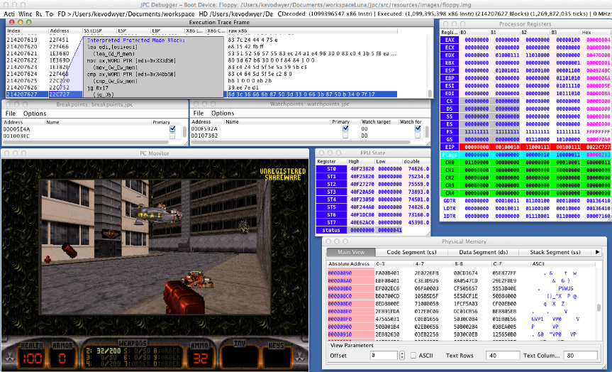

# JPC

A pure-Java x86 PC emulator with a Swing-based time-travel debugger.

JPC implements an x86 software CPU plus motherboard model in 100% portable Java. It boots DOS, Windows up to Windows 95 (98 in safe mode), several graphical Linuxes, and — as of the current development branch — an i386 NetBSD 11.0 kernel through full device autoconf (see [Status](#status)). The debugger supports breakpoints, watchpoints, single-step, and full time-travel.

---

## Status

The emulator currently models a late-1990s Pentium II / PIIX3 PC. Recent work targeted compatibility with NetBSD/i386 11.0; that experiment is documented in [`.report/0001.md`](.report/0001.md) … [`.report/0007.md`](.report/0007.md).

| Guest OS                      | State        |
|-------------------------------|--------------|
| FreeDOS (bundled image)       | Boots and runs |
| MS-DOS / Win3.x               | Boots and runs |
| Windows 95                    | Boots and runs |
| Windows 98                    | Boots in safe mode |
| Various Linuxes (older kernels) | Boots and runs |
| **NetBSD/i386 11.0_RC2**      | Bootloader ✅, kernel banner ✅, full PCI/ISA device probe ✅, then crashes at `spllower+0x37` (privileged instruction fault). See [`.report/0007.md`](.report/0007.md). |
| NetBSD/amd64 (any version)    | Not supported (no long mode) |
| Modern Linux ≥3.x             | Not tested; expected to fail without working LAPIC timer |

Recent additions in the development branch (April 2026):

- `Pentium II` (`cpuLevel=6`) became the default CPU level. The PII featureset includes PAE, SYSENTER, CMOV, MMX. ([0002](.report/0002.md))
- Architectural MSRs (`IA32_APIC_BASE`, `IA32_MTRRCAP`, `IA32_PAT`, `IA32_MISC_ENABLE`, …) seeded with sensible reset values. ([0002](.report/0002.md))
- Static Intel MP 1.4 table overlaid in BIOS shadow ROM. ([0003](.report/0003.md))
- LAPIC and IO-APIC MMIO stubs (read/write storage; **no interrupt delivery yet**). ([0004](.report/0004.md))
- ACPI 1.0 table set (RSDP+RSDT+MADT+FACP+DSDT) overlaid in BIOS shadow ROM. ([0005](.report/0005.md))
- `IdeStats` per-IDEChannel command counters and a `-trace-ide` CLI flag for ATA/ATAPI command logging. ([0006](.report/0006.md))
- First JUnit test suite in the project (`jpc-core/src/test/java/`, JUnit 5, currently 102 tests).

Known limitations relevant to running modern guests:

- LAPIC/IO-APIC are crash-proof storage but do not deliver real interrupts — required for any guest that uses APIC for SPL/timing.
- ACPI/MP-table overlays at `0xFB000`/`0xFC000` partially overlap with Bochs BIOS dynamic-table region (`0xfb778-0xfcc00`); some guests will not find the static RSDP we ship. ([0007 §3.1](.report/0007.md))
- `Option.noScreen` (`-no-screen`) is declared but `JPCApplication` always opens a `JFrame`; running under `-Djava.awt.headless=true` therefore fails.
- `SYS_RAM_SIZE` and `Processor.cpuLevel` are `static` — only one `PC` can sensibly exist per JVM.
- Default RAM is 16 MB — anything modern needs `-ram 64` (or larger).

---

## Hardware configuration

The emulated machine is described in detail in [`CLAUDE.md`](CLAUDE.md); below is the headline summary. Files live under `jpc-core/src/main/java/org/jpc/emulator/`.

| Subsystem | Implementation |
|-----------|----------------|
| CPU       | Software interpreter + JIT-ish optimiser (`execution/codeblock/`); modes: real (`opcodes/rm/`), protected (`pm/`), virtual-8086 (`vm/`); levels: 486 / Pentium / **Pentium II** (selectable via `-cpulevel`); FPU via `processor/fpu64/`. **No long mode, no SSE/SSE2.** |
| Memory    | 16 MB default (configurable via `-ram`), `PhysicalAddressSpace` with 4 KB block granularity, `LinearAddressSpace` with TLB, PAE-flag advertised but not exercised |
| BIOS      | Bochs BIOS (128 KB, `resources/bios/bios.bin`), VGABIOS (`vgabios.bin`) |
| Motherboard | PIIX3 chipset, BochsPIT, 8259 PIC, RTC, DMA, A20 gate |
| PCI       | Host bridge + PIIX3 ISA bridge + bus, IDE controller (`PIIX3IDEInterface`), VGA card (Bochs VBE-compatible at vendor `0x1234`), NE2000 ethernet (optional) |
| LAPIC     | MMIO stub at `0xFEE00000` (storage only) |
| IO-APIC   | MMIO stub at `0xFEC00000` (storage only) |
| MP-table  | Static MP 1.4 in BIOS shadow at `0xFC000` |
| ACPI      | Static ACPI 1.0 (RSDP/RSDT/MADT/FACP/DSDT) in BIOS shadow at `0xFB000` |
| ATA       | Full ATA + ATAPI (CD-ROM bootable via El Torito) |
| Floppy    | Standard PC floppy controller |
| Serial    | 4 × 16450 UART (COM1–COM4) |
| Sound     | SoundBlaster 16, Adlib, MPU-401, PC speaker (opt-in via `-sound`) |
| Input     | PS/2 keyboard + mouse |
| Network   | NE2000 (Bochs-port, opt-in via `-ethernet`) |

The stack is single-CPU only (`MpTable` declares one BSP). There is no SMP, no virtio, no AHCI, no USB.

---

## Building

JPC is a Maven multi-module project (Java 17, compiles with `--release 17`; runs on any JDK ≥ 17). All build output lives in a single top-level `target/` directory.

```bash
mvn -DskipTests package          # builds everything: target/jpc-app/JPCApplication.jar (uber-jar)
                                 # plus target/{jpc-core,jpc-debugger,jpc-tools}/<artifact>.jar

mvn -pl jpc-app -am -DskipTests package  # build only the runnable uber-jar (and its deps)
mvn -pl jpc-core -am compile             # fast compile-only check of the emulator core
mvn clean                                # wipe target/
```

Modules:

| Module          | Contents                                                                       |
|-----------------|--------------------------------------------------------------------------------|
| `jpc-core`      | Emulator core, host-I/O glue, Swing front-end (`org.jpc.emulator.*`, `org.jpc.support`, `org.jpc.j2se`) |
| `jpc-debugger`  | Swing debugger UI (`org.jpc.debugger`)                                         |
| `jpc-tools`     | Build-time / dev tools: decoder generator, test generator, Bochs comparator, fuzzer |
| `jpc-app`       | The shaded uber-jar (`Main-Class: org.jpc.j2se.JPCApplication`)                |

---

## Running

The shaded jar's manifest carries a `Default-Args` entry (`-fda mem:resources/images/floppy.img -hda mem:resources/images/dosgames.img -boot fda`), so a bare invocation boots the bundled FreeDOS floppy:

```bash
java -jar target/jpc-app/JPCApplication.jar
```

Common scenarios:

```bash
# Boot from a hard-disk image
java -jar target/jpc-app/JPCApplication.jar -boot hda -hda /path/to/disk.img

# Boot from a CD-ROM ISO
java -jar target/jpc-app/JPCApplication.jar -boot cdrom -cdrom /path/to/system.iso

# Mount a host directory as a virtual FAT32 hard disk (read-only)
java -jar target/jpc-app/JPCApplication.jar -boot hda -hda dir:/path/to/dosgames

# Same, but writes pass through to the host directory
java -jar target/jpc-app/JPCApplication.jar -boot hda -hda dir:sync:/path/to/dosgames

# More RAM, Pentium-II CPU (the default), trace IDE commands
java -jar target/jpc-app/JPCApplication.jar -boot cdrom -cdrom system.iso -ram 128 -trace-ide

# Get the full option list
java -jar target/jpc-app/JPCApplication.jar -help
```

For NetBSD/i386 install media (bootloader works; kernel reaches autoconf — see [Status](#status)):

```bash
curl -L -o /tmp/netbsd-bootcom.iso \
  https://cdn.netbsd.org/pub/NetBSD/NetBSD-11.0_RC2/i386/installation/cdrom/boot-com.iso

java -jar target/jpc-app/JPCApplication.jar \
  -boot cdrom -cdrom /tmp/netbsd-bootcom.iso -ram 64
```

Useful flags (full list in `org.jpc.j2se.Option`):

| Flag                 | What it does |
|----------------------|--------------|
| `-ram <MB>`          | Guest RAM in megabytes (default 16; bump to ≥64 for any modern guest) |
| `-cpulevel <4\|5\|6>` | 486 / Pentium / Pentium II — default 6 |
| `-boot <fda\|hda\|cdrom>` | Boot device |
| `-fda <spec>`, `-hda <spec>`, `-cdrom <spec>` | Drive specs (`/path/file.img`, `dir:/path`, `dir:sync:/path`, `mem:resources/...`) |
| `-bios <path>`       | Replace the system BIOS image |
| `-ethernet`          | Enable the NE2000 NIC |
| `-sound`             | Enable SB16/Adlib/MPU-401 |
| `-deterministic -start-time <ms>` | Reproducible execution (used by the test/fuzz infra) |
| `-trace-ide`         | Log every ATA/ATAPI command at INFO level |
| `-log-state`, `-log-disam`, `-debug-blocks` | Various tracing knobs (verbose) |

---

## Testing

JUnit 5 lives in `jpc-core/src/test/java/`. Run the full suite with:

```bash
mvn -pl jpc-core test
```

Currently 102 tests across the following packages:

| Test class | What it covers |
|------------|----------------|
| `processor.ProcessorMsrDefaultsTest`   | MSR seeding, default `cpuLevel`, set/get round-trip |
| `motherboard.MpTableTest`              | MP 1.4 floating pointer + configuration table layout, checksums, entries |
| `motherboard.AcpiTest`                 | ACPI 1.0 RSDP/RSDT/MADT/FACP/DSDT layout, signatures, checksums, AML body |
| `motherboard.LocalApicTest`            | LAPIC MMIO storage, reset values, R/W round-trip, RO behaviour, code-execution refusal |
| `motherboard.IoApicTest`               | IO-APIC IOREGSEL/IOWIN indirect access, redirection table defaults, RO behaviour |
| `pci.peripheral.IdeStatsTest`          | ATA/ATAPI command counters, snapshots, mnemonic lookup, reset |

In addition there are non-JUnit fixtures and tools for instruction-level work, none of which run as part of `mvn test`:

- `tests/<mnemonic>/` — per-instruction regression fixtures consumed by `tools.TestGenerator` / `tools.OracleFuzzer`.
- `targetedFuzz.sh <config>` — discovers the unique encodings used while booting a target config and feeds them to randomized testing.
- `tools.CompareToBochs`, `tools.OracleFuzzer` — cross-check JPC's CPU against Bochs as an oracle.

### Regenerating the decoder

`jpc-core/.../execution/decoder/ExecutableTables.java` and the per-opcode handler classes under `jpc-core/.../execution/opcodes/{rm,pm,vm}/` are **generated** from `jpc-tools/src/main/resources/Opcodes_*.xml`. After changing the XML or the generator, run:

```bash
./regenerate_decoder.sh
```

The script builds `jpc-tools`, runs `tools.Tools -decoder` to regenerate the tables, and rebuilds `jpc-app`.

---

## Debugger

The JPC debugger is a separate Swing UI that lets you step through x86 code, set breakpoints/watchpoints, view memory and CPU state, and time-travel execution forward and backward.

Build it (`mvn package` already builds it; the jar lands at `target/jpc-debugger/jpc-debugger.jar`). Configure disks via the menus or by passing the same `-fda`/`-hda`/`-cdrom` flags as the application, then **File → Create New PC** followed by **Run → Start**.



---

## Development log

Current work is tracked as numbered increments under `.report/`:

- [`.report/MAIN.md`](.report/MAIN.md) — index, cross-cutting blockers, sweep of suggested improvements.
- [`.report/0001.md`](.report/0001.md) — analysis: requirements for NetBSD 11.0 and gap to current JPC.
- [`.report/0002.md`](.report/0002.md) … [`.report/0006.md`](.report/0006.md) — Stage B: PII default, MSR stubs, MP-table, ACPI, LAPIC/IO-APIC stubs, IDE diagnostics.
- [`.report/0007.md`](.report/0007.md) — Stage B7: actual NetBSD/i386 11.0 boot attempt and detailed crash analysis.

Each increment is a self-contained, testable, build-green delta; suggestions for follow-up work live in a section at the end of each file.

---

## Credits

- The system BIOS is the [Bochs BIOS](http://bochs.sourceforge.net/).
- The VGA BIOS is the [Plex86/Bochs LGPL'd VGA BIOS](http://www.nongnu.org/vgabios/).
- The bundled `floppy.img` is from the [Odin FreeDOS project](http://odin.fdos.org/).

---

## History

JPC was originally started in the Particle Physics department of Oxford University by Dr Rhys Newman and Dr Jeff Tseng. The original team included Chris Dennis, Ian Preston, Mike Moleschi, and Guillaume Kirsch. Subsequent maintenance has been by Ian Preston and Kevin O'Dwyer.
